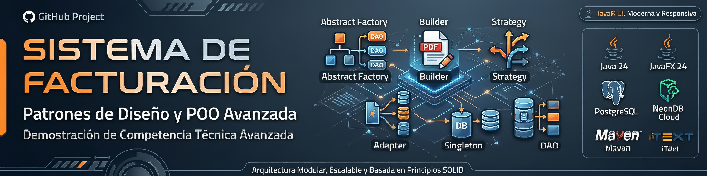
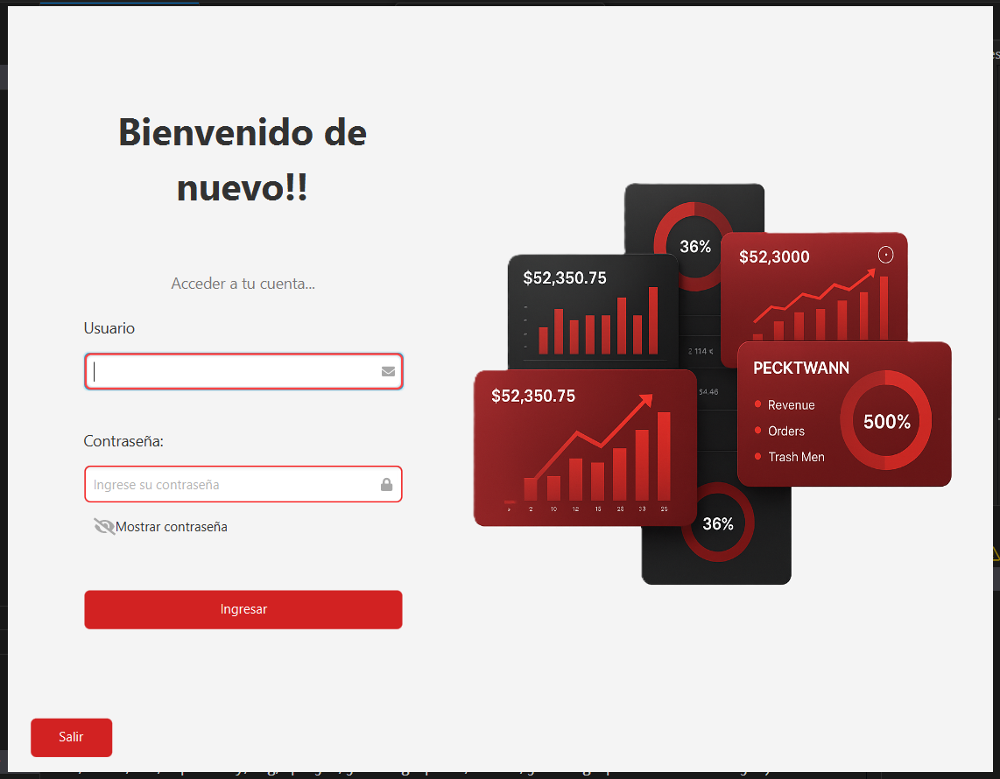
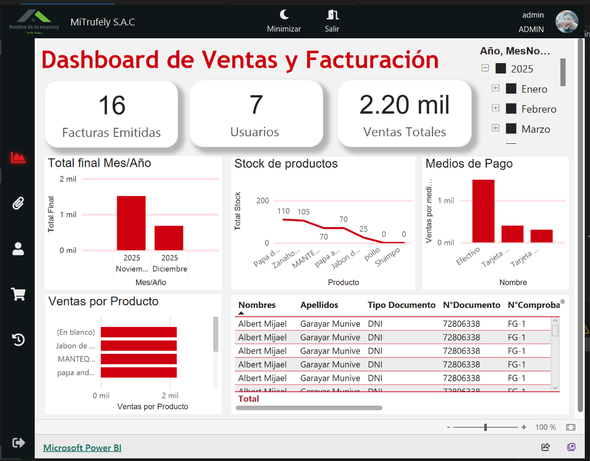
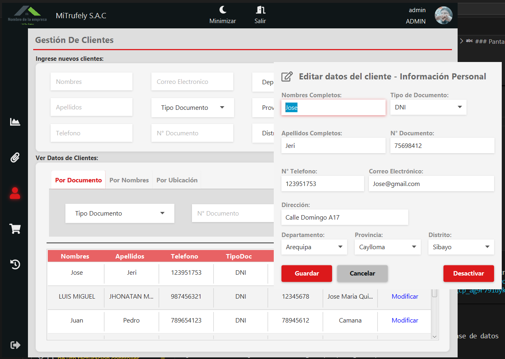
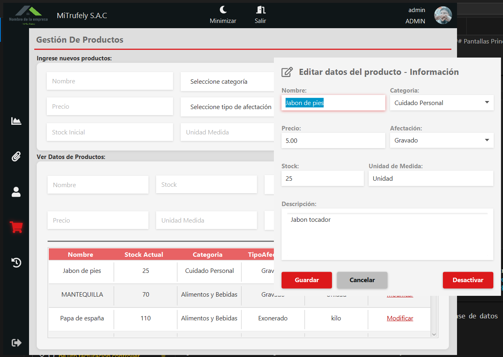
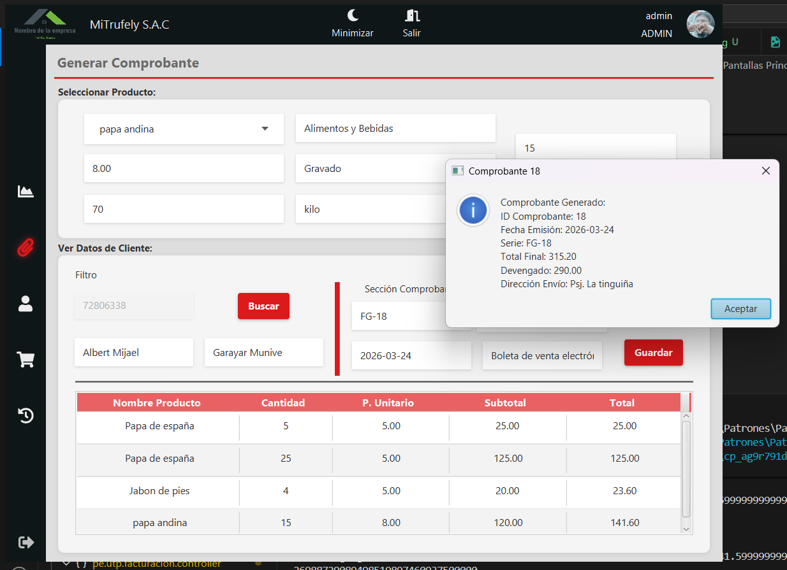
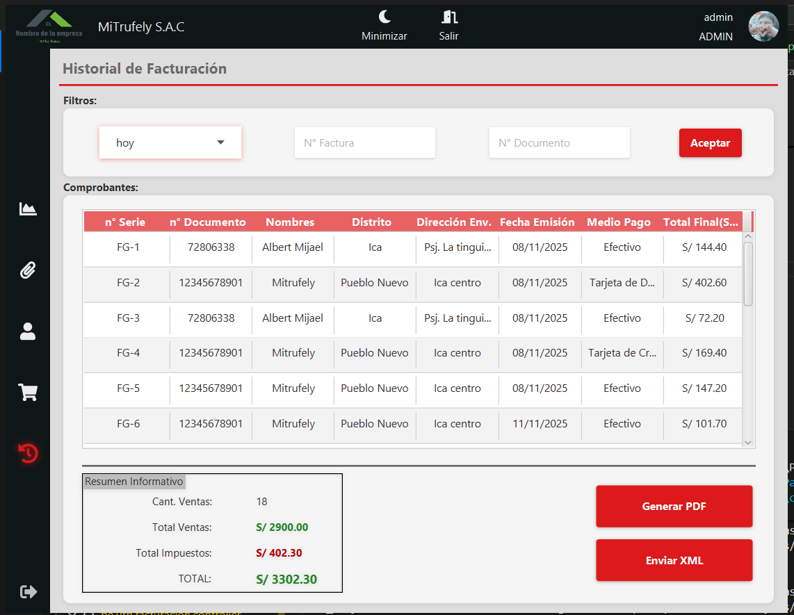

# 🧾 Sistema de Facturación - Patrones de Diseño y POO Avanzada



---

## 📌 Descripción Ejecutiva

**Billing System** es una aplicación empresarial de facturación desarrollada en Java que demuestra el dominio avanzado de **Patrones de Diseño** y **Programación Orientada a Objetos (POO)**. El sistema implementa una arquitectura modular y escalable basada en principios SOLID, con separación clara de responsabilidades mediante capas arquitectónicas especializadas. La interfaz gráfica, construida íntegramente en **JavaFX**, proporciona una experiencia visual moderna y responsiva, mientras que el backend se sustenta en una base de datos PostgreSQL alojada en **NeonDB** (cloud).

---

## 🎯 Propósito Central

Este proyecto fue desarrollado como **demostración de competencia técnica avanzada** en:

- ✅ **Patrones de Diseño**: Abstract Factory, Builder, Strategy, Adapter, Singleton, DAO
- ✅ **Programación Orientada a Objetos**: Herencia, Polimorfismo, Encapsulamiento, Abstracción
- ✅ **Arquitectura de Software**: Layered Architecture, MVC, DAO Pattern
- ✅ **Desarrollo de Interfaces Gráficas**: JavaFX con FXML
- ✅ **Persistencia de Datos**: Conexión a bases de datos en la nube
- ✅ **Generación de Documentos**: PDF y XML con patrones de construcción

---

## 🏗️ Stack Tecnológico


| Componente | Versión | Propósito |
|-----------|---------|----------|
| **Java JDK** | 24 | Runtime y compilación |
| **JavaFX** | 24.0.1 | Framework de interfaz gráfica |
| **PostgreSQL** | 15+ | SGBD relacional |
| **NeonDB** | Cloud | Hosting de BD PostgreSQL serverless |
| **Maven** | 3.8.1+ | Gestor de dependencias y build |
| **iText** | 5.5.13 | Generación de PDFs |
| **iKonli** | 12.4.0 | Librería de iconos (FontAwesome, Ant Design) |
| **JavaMail** | 1.6.2 | Envío de correos electrónicos |
| **JOL** | 0.16 | Análisis de memory layouts |

---

## 🎨 Patrones de Diseño Identificados y Aplicados

### 1️⃣ **ABSTRACT FACTORY** - Creación de Familias de Objetos DAO
**Ubicación**: `persistence.dao.DAOFactory` y `persistence.impl.PostgresDAOFactory`

**Problema Resuelto**: Cambiar entre diferentes bases de datos (PostgreSQL, MySQL, etc.) sin modificar el código cliente.

**Implementación**:
```java
// DAOFactory actúa como fábrica abstracta
DAOFactory factory = DAOFactory.getDAOFactory(DAOFactory.POSTGRES);
DAOCliente daoCliente = factory.getClienteDAO();
DAOProducto daoProducto = factory.getProductoDAO();
```

**Análisis Técnico**:
- Define interfaz abstracta con métodos factory para crear diferentes tipos de DAOs
- PostgresDAOFactory implementa métodos concretos para PostgreSQL
- Permite agregar nuevas familias de DAOs (MySQL, Oracle) sin modificar código existente
- Encapsula la lógica de creación y garantiza consistencia entre productos de la familia

**Beneficio**: Desacoplamiento entre cliente y implementaciones específicas de bases de datos. Facilita testabilidad y mantenimiento.

---

### 2️⃣ **BUILDER PATTERN** - Construcción Compleja de PDFs
**Ubicación**: `patterns.builder.*` (GeneradorPDFBuilder, GeneradorPDFDirector, GeneradorBoletaPDF, GeneradorFacturaPDF)

**Problema Resuelto**: Construcción de documentos PDF complejos con múltiples secciones (encabezado, cuerpo, pie) sin crear constructores gigantes ni parámetros opcionales.

**Implementación Técnica**:
```
GeneradorPDFDirector (Orchestrator)
    ↓
GeneradorPDFBuilder (Interface)
    ┣→ GeneradorBoletaPDF (Concrete Builder)
    └→ GeneradorFacturaPDF (Concrete Builder)
        ↓
AbstractGeneradorPDF (Base implementation)
```

**Flujo de Construcción**:
1. `iniciarDocumento()` - Abre documento PDF e inicializa writer
2. `agregarEncabezado()` - Agrega datos de empresa
3. `agregarDatosCliente()` - Inserta información del cliente
4. `agregarCuerpo()` - Construye tabla de items con detalles
5. `agregarPie()` - Agrega totales e información fiscal
6. `finalizarDocumento()` - Cierra y guarda el PDF

**Ventaja del Patrón**:
- Separación clara de responsabilidades: cada método construye una sección
- Reutilización: Director puede reutilizar builders para diferentes tipos de comprobantes
- Flexibilidad: Fácil agregar nuevos tipos de documentos creando nuevos builders

---

### 3️⃣ **STRATEGY PATTERN** - Navegación Polimórfica
**Ubicación**: `patterns.strategy.NavegacionStrategy` y sus implementaciones (NavClientes, NavFacturacion, NavProductos, NavDashboard, NavHistorial, NavConfiguracion)

**Problema Resuelto**: Sistema de navegación flexible donde cada módulo implementa lógica particular de validación de permisos y acceso.

**Interfaz Base**:
```java
public interface NavegacionStrategy {
    void navegar() throws IOException;
    boolean tienePermiso();
    String getNombrePantalla();
}
```

**Implementaciones Concretas**:
- `NavClientes` - Validación y acceso al módulo de clientes
- `NavFacturacion` - Validación de permisos para facturación
- `NavProductos` - Control de acceso a inventario
- Etc.

**Ventaja**:
- Cada estrategia encapsula comportamiento diferente de navegación
- En tiempo de ejecución, se selecciona la estrategia sin modificar código cliente
- Fácil pruebas unitarias: cada estrategia es independiente

---

### 4️⃣ **ADAPTER PATTERN** - Unificación de Generadores XML
**Ubicación**: `patterns.adapter.XMLGenerator` y sus implementaciones (BoletaXMLGenerator, FacturaXMLGenerator)

**Problema Resuelto**: Adaptación de generadores XML heterogéneos para que implemente una interfaz común, permitiendo que el código cliente trate de manera uniforme diferentes tipos de comprobantes.

**Interfaz Unificada**:
```java
public interface XMLGenerator {
    String generar(Comprobante comprobante);
}
```

**Implementaciones**:
- `BoletaXMLGenerator` - Genera XML conforme a estándar de Boletas
- `FacturaXMLGenerator` - Genera XML conforme a estándar de Facturas
- `MailTrapEmailAdapter` - Adapta servicio de correo externo

**Flujo de Ejecución**:
```
XMLGeneratorFactory.getXMLGenerator(tipoComprobante)
    ↓
Retorna implementación específica (Boleta o Factura)
    ↓
Cliente llama generar(comprobante)
```

**Beneficio**: Código cliente agnóstico al tipo de comprobante. Cada adaptador encapsula lógica de formateo XML específica.

---

### 5️⃣ **SINGLETON PATTERN** - Gestión Única de Conexión BD
**Ubicación**: `persistence.ConexionBD`

**Problema Resuelto**: Garantizar que exista una única instancia de conexión a la base de datos en toda la aplicación, evitando múltiples conexiones simultáneas y consumo innecesario de recursos.

**Implementación**:
```java
public class ConexionBD {
    private static ConexionBD instance;
    private Connection connection;

    private ConexionBD() throws SQLException {
        // Conexión a NeonDB (PostgreSQL en cloud)
    }

    public static ConexionBD getInstance() throws SQLException {
        if (instance == null || instance.getConnection().isClosed()) {
            instance = new ConexionBD();
        }
        return instance;
    }
}
```

**Características**:
- Constructor privado: previene instanciación directa
- Lazy initialization: se crea sólo cuando se necesita
- Validación de estado: verifica si la conexión aún está activa
- Thread-safe: validaciones incluidas para concurrencia

---

### 6️⃣ **DAO PATTERN** - Abstracción de Persistencia
**Ubicación**: `persistence.dao.*` y `persistence.impl.*`

**Problema Resuelto**: Aislar la lógica de acceso a datos de la lógica de negocio, permitiendo cambiar el mecanismo de almacenamiento sin afectar capas superiores.

**Arquitectura DAO**:
```
DAOInterface (e.g., DAOCliente)
    ↓
Implementación Concreta (PostgresDAOClienteImpl)
    ↓
ConexionBD (Singleton)
```

**DAOs Implementados**:
- `DAOCliente` - CRUD para clientes
- `DAOProducto` - Gestión de productos
- `DAOComprobante` - Manejo de comprobantes
- `DAODetalleComprobante` - Líneas de comprobante
- `DAOUsuario` - Autenticación y usuarios
- `DAOUbigeo` - Datos geográficos
- `DAOMedioPago` - Medios de pago
- Y más...

---

## 🏛️ Arquitectura General

### Diagrama de Capas

```
┌─────────────────────────────────────────────────────┐
│          UI LAYER (JavaFX FXML)                     │
│   ├─ login.fxml                                     │
│   ├─ Menu.fxml, Dashboard.fxml                      │
│   ├─ GenClientes.fxml, GenProductos.fxml           │
│   ├─ GenFacturas.fxml, History.fxml                │
│   └─ ModCliente.fxml, ModProducto.fxml             │
└─────────────────────────────────────────────────────┘
              ↓ (event handling)
┌─────────────────────────────────────────────────────┐
│   PRESENTATION/CONTROLLER LAYER                      │
│   ├─ ControllerLogin                               │
│   ├─ ControllerMenu, DashboardController           │
│   ├─ ControllerClientes, ControllerProducts        │
│   ├─ ControllerFacturas, ControllerHistorial       │
│   └─ ControllerTopMenu                             │
└─────────────────────────────────────────────────────┘
              ↓ (business logic delegation)
┌─────────────────────────────────────────────────────┐
│         SERVICE LAYER (Business Logic)               │
│   ├─ ClienteService                                │
│   ├─ ProductoService                               │
│   ├─ ComprobanteService                            │
│   ├─ AuthenticationService                         │
│   ├─ genPDFService (PDF generation)                │
│   ├─ XMLService (XML generation)                   │
│   └─ PermisosNavegacion (permissions)              │
└─────────────────────────────────────────────────────┘
              ↓ (CRUD operations)
┌─────────────────────────────────────────────────────┐
│   PERSISTENCE LAYER (DAO Pattern)                    │
│   ├─ DAOFactory (Abstract Factory)                 │
│   ├─ DAOCliente, DAOProducto, DAOComprobante...   │
│   ├─ PostgresDAOFactory / PostgresDAOClienteImpl    │
│   └─ ConexionBD (Singleton)                        │
└─────────────────────────────────────────────────────┘
              ↓ (JDBC)
┌─────────────────────────────────────────────────────┐
│      DATABASE LAYER (NeonDB - PostgreSQL)           │
│   ├─ Customers Table                               │
│   ├─ Products Table                                │
│   ├─ Invoices (Comprobante)                        │
│   ├─ Invoice Details (Detalles)                    │
│   └─ Reference Tables (Departments, Districts...)  │
└─────────────────────────────────────────────────────┘
```

### Patrón MVC + Separation of Concerns

```
MODEL LAYER (packages)
├─ Entity Classes: Cliente, Producto, Comprobante...
├─ Value Objects: TipoDocumento, MedioPago...
└─ Domain Models with getters/setters

VIEW LAYER (resources)
├─ FXML Markup: login.fxml, GenClientes.fxml...
├─ CSS Styling: styleLogin.css, styleMenu.css...
├─ Fonts: Roboto (Thin, Regular, Bold)
└─ Images & Icons: Ikonli FontAwesome integration

CONTROLLER LAYER (pe.utp.facturacion.controller)
├─ Event Handlers (@FXML methods)
├─ Service Injection
└─ View State Management
```

---

## 🔄 Flujos de Procesos Clave

### 1. Flujo de Autenticación
```
Login UI (ControllerLogin)
    ↓ usuario.getTipo() 
AuthenticationService.validar(usuario, contraseña)
    ↓
DAOUsuario.obtenerPorCredenciales()
    ↓
Validación en ConexionBD
    ↓ ✅ Éxito: Carga permisos en sesión
Menu + NavegacionStrategy
```

### 2. Flujo de Facturación
```
GenFacturas UI (ControllerFacturas)
    ↓ Selecciona cliente + items
ComprobanteService.crear(cliente, detalles)
    ↓
DAOComprobante.insertar() + DAODetalleComprobante.insertar()
    ↓
genPDFService.generar() 
    → GeneradorPDFDirector + GeneradorFacturaPDF Builder
    ↓ Genera PDF
XMLService.generar()
    → XMLGeneratorFactory.getXMLGenerator(FACTURA)
    → FacturaXMLGenerator.generar()
    ↓ Guarda XML
```

### 3. Flujo de Navegación Estratégica
```
ControllerMenu.navegar(tipoModulo)
    ↓
NavegacionStrategy strategy = obtenerStrategy(tipoModulo)
    ↓
if (strategy.tienePermiso()) {
    strategy.navegar()
    App.setRoot(strategy.getNombrePantalla())
}
```

---

## 📊 Aplicación de Pilares OOP

### 1. **Herencia** 🧬
```java
// HIERARQUÍA DE HERENCIA
AbstractGeneradorPDF (Abstract Base Class)
    ├─ GeneradorBoletaPDF extends AbstractGeneradorPDF
    └─ GeneradorFacturaPDF extends AbstractGeneradorPDF

// Entidades modela-cliente-servidor
Clase Base: Cliente
Subclases implícitas: ClientePJuridica, ClientePersonaNatural
(aunque en este código están unificadas)
```

**Ejemplo Técnico**:
- `AbstractGeneradorPDF` define métodos abstractos para construcción PDF
- Subclases concretas implementan lógica específica (tipos de boleta vs factura)
- Reutilización de código: métodos comunes de formateo

---

### 2. **Polimorfismo** 🔄
```java
// POLIMORFISMO POR INTERFAZ
NavegacionStrategy estrategia1 = new NavClientes();
NavegacionStrategy estrategia2 = new NavFacturacion();
// Ambos implemente el mismo interface

XMLGenerator generador = XMLGeneratorFactory
    .getXMLGenerator(tipoComprobante);
// Retorna BoletaXMLGenerator o FacturaXMLGenerator

// POLIMORFISMO EN DAO
DAOFactory factory = DAOFactory.getDAOFactory(POSTGRES);
DAOCliente dao = factory.getClienteDAO();
// Retorna PostgresDAOClienteImpl automáticamente
```

**Beneficio**: Código cliente no necesita conocer tipos concretos. Cambios en implementaciones no afectan las llamadas.

---

### 3. **Encapsulamiento** 🔐
```java
public class Cliente {
    // Atributos PRIVADOS (no accesibles directamente)
    private Long idCliente;
    private String nombres;
    private String correo;
    
    // GETTERS/SETTERS controlados
    public String getNombres() { return nombres; }
    public void setNombres(String nombres) {
        if (nombres != null && !nombres.isEmpty()) {
            this.nombres = nombres;
        }
    }
    
    // Constructor vacío (JavaFX + frameworks)
    public Cliente() {}
    
    // Constructor parametrizado completo
    public Cliente(Long idCliente, String nombres, ...) { ... }
}
```

**Ventajas**:
- Protección de datos: no se puede asignar valores inválidos
- Flexibilidad futura: puedo agregar validaciones en setters
- Mantenibilidad: cambios internos no afectan código cliente

---

### 4. **Abstracción** 🎯
```java
// ABSTRACTO: DAOFactory
public abstract class DAOFactory {
    public abstract DAOCliente getClienteDAO();
    public abstract DAOProducto getProductoDAO();
    public abstract DAOComprobante getComprobanteDAO();
    // ... otros
}

// ABSTRACTO: NavegacionStrategy
public interface NavegacionStrategy {
    void navegar() throws IOException;
    boolean tienePermiso();
    String getNombrePantalla();
}

// ABSTRACTO: GeneradorPDFBuilder
public interface GeneradorPDFBuilder {
    void iniciarDocumento(String rutaSalida) throws Exception;
    void agregarEncabezado(Empresa empresa) throws Exception;
    void agregarDatosCliente(Cliente cliente, Comprobante comprobante) throws Exception;
    // ...
}
```

**Logro de Abstracción**:
Oculto detalles de implementación, expongo solo funcionalidades necesarias. Referencias, permite que cliente use abstracción sin preocuparse por cómo funciona internamente.

---

## 📁 Estructura del Directorio Detallada

```
Patrones/
├── demo/
│   ├── pom.xml                          # Configuración Maven (Java 24, dependencies)
│   ├── dependency-reduced-pom.xml       # POM reducido (build)
│   │
│   └── src/main/
│       ├── java/pe/utp/facturacion/
│       │   ├── core/
│       │   │   └── App.java             # Punto de entrada JavaFX
│       │   │
│       │   ├── controller/              # MVC Controllers (event handlers)
│       │   │   ├── ControllerLogin.java
│       │   │   ├── ControllerMenu.java
│       │   │   ├── DashboardController.java
│       │   │   ├── ControllerClientes.java
│       │   │   ├── ControllerProducts.java
│       │   │   ├── ControllerFacturas.java
│       │   │   ├── ControllerHistorial.java
│       │   │   ├── ControllerModCliente.java
│       │   │   ├── ControllerModProductos.java
│       │   │   ├── ControllerTopMenu.java
│       │   │   └── ...
│       │   │
│       │   ├── model/                   # Entity Objects (POJO)
│       │   │   ├── Cliente.java
│       │   │   ├── Producto.java
│       │   │   ├── Comprobante.java
│       │   │   ├── DetalleComprobante.java
│       │   │   ├── Empresa.java
│       │   │   ├── GenerarPDF.java
│       │   │   ├── TipoDocumento.java
│       │   │   ├── TipoComprobante.java
│       │   │   ├── MedioPago.java
│       │   │   ├── CategoriaProductos.java
│       │   │   ├── Departamento.java
│       │   │   ├── Provincia.java
│       │   │   ├── Distrito.java
│       │   │   ├── TipoImpuestos.java
│       │   │   ├── AfectacionProductos.java
│       │   │   ├── Usuario.java
│       │   │   └── Prueba.java
│       │   │
│       │   ├── patterns/                # Design Patterns Implementation
│       │   │   ├── adapter/             # ADAPTER: XML Generation
│       │   │   │   ├── XMLGenerator.java              # Interfaz
│       │   │   │   ├── BoletaXMLGenerator.java
│       │   │   │   ├── FacturaXMLGenerator.java
│       │   │   │   ├── MailTrapEmailAdapter.java
│       │   │   │   └── XMLGeneratorFactory.java
│       │   │   │
│       │   │   ├── builder/             # BUILDER: PDF Construction
│       │   │   │   ├── GeneradorPDFBuilder.java       # Interfaz
│       │   │   │   ├── AbstractGeneradorPDF.java      # Base impl
│       │   │   │   ├── GeneradorBoletaPDF.java        # Concrete
│       │   │   │   ├── GeneradorFacturaPDF.java       # Concrete
│       │   │   │   ├── GeneradorPDFDirector.java      # Orchestrator
│       │   │   │   └── GeneradorPDFFactory.java
│       │   │   │
│       │   │   └── strategy/            # STRATEGY: Navigation
│       │   │       ├── NavegacionStrategy.java        # Interfaz
│       │   │       ├── NavClientes.java
│       │   │       ├── NavFacturacion.java
│       │   │       ├── NavProductos.java
│       │   │       ├── NavDashboard.java
│       │   │       ├── NavHistorial.java
│       │   │       ├── NavConfiguracion.java
│       │   │       └── json/                          # Config files
│       │   │
│       │   ├── persistence/             # Data Access Layer
│       │   │   ├── ConexionBD.java      # SINGLETON: DB Connection
│       │   │   │
│       │   │   ├── dao/                 # DAO Interfaces
│       │   │   │   ├── DAOFactory.java              # ABSTRACT FACTORY
│       │   │   │   ├── DAOCliente.java
│       │   │   │   ├── DAOProducto.java
│       │   │   │   ├── DAOComprobante.java
│       │   │   │   ├── DAODetalleComprobante.java
│       │   │   │   ├── DAOUsuario.java
│       │   │   │   ├── DAOCategoriaProducto.java
│       │   │   │   ├── DAOMedioPago.java
│       │   │   │   ├── DAOTipoComprobante.java
│       │   │   │   ├── DAOTipoDocumento.java
│       │   │   │   ├── DAOTipoAfectacion.java
│       │   │   │   ├── DAOTipoImpuestos.java
│       │   │   │   ├── DAOUbigeo.java
│       │   │   │   ├── DAODistrito.java
│       │   │   │   └── DAOUtils.java
│       │   │   │
│       │   │   └── impl/                # DAO Implementations
│       │   │       ├── PostgresDAOFactory.java
│       │   │       ├── PostgresDAOClienteImpl.java
│       │   │       ├── PostgresDAOProductoImpl.java
│       │   │       ├── PostgresDAOComprobanteImpl.java
│       │   │       └── ...
│       │   │
│       │   ├── service/                 # Business Logic Services
│       │   │   ├── ClienteService.java
│       │   │   ├── ProductoService.java
│       │   │   ├── ComprobanteService.java
│       │   │   ├── DetalleComprobanteService.java
│       │   │   ├── AuthenticationService.java
│       │   │   ├── genPDFService.java
│       │   │   ├── XMLService.java
│       │   │   ├── CategoriaService.java
│       │   │   ├── MedioPagoService.java
│       │   │   ├── TipoComprService.java
│       │   │   ├── TipoDocumentoService.java
│       │   │   ├── AfectacionService.java
│       │   │   ├── UbigeoService.java
│       │   │   ├── PermisosNavegacion.java
│       │   │   └── ManejadorService.java
│       │   │
│       │   ├── ui/                     # UI Utilities
│       │   │   └── loading/
│       │   │
│       │   └── util/                   # Utilities & Helpers
│       │       └── reader/
│       │
│       └── resources/pe/utp/facturacion/
│           ├── login.fxml              # Login View
│           ├── Menu.fxml               # Main Menu
│           ├── Dashboard.fxml          # Dashboard
│           ├── GenClientes.fxml        # Generate/List Clients
│           ├── GenProductos.fxml       # Generate/List Products
│           ├── GenFactures.fxml        # Generate Invoices
│           ├── History.fxml            # Invoice History
│           ├── ModCliente.fxml         # Modify Client
│           ├── ModProducto.fxml        # Modify Product
│           ├── TopMenu.fxml            # Top Menu Bar
│           ├── example.fxml
│           ├── fonts/
│           │   ├── Roboto-Thin.ttf
│           │   ├── Roboto-Regular.ttf
│           │   └── Roboto-Bold.ttf
│           ├── images/                 # Application images
│           ├── styles/                 # CSS StyleSheets
│           │   ├── styleLogin.css
│           │   ├── styleMenu.css
│           │   ├── styleTop.css
│           │   └── genFact.css
│           ├── PDFs/                   # Generated PDF outputs
│           └── xml/                    # Generated XML files
│               ├── Comprobante_BL-001_20251117_225235.xml
│               ├── Comprobante_FG-001_20251117_225233.xml
│               └── ...
│
└── genPDFService_Facade_UML.puml       # UML Architecture Diagram

```

---

## 💻 Configuración y Ejecución

### Prerequisitos
- **Java JDK 24** o superior
- **Maven 3.8.1** o superior
- **PostgreSQL 15+** (o acceso a NeonDB)
- **Git** (opcional, para clonar)

### Configuración Maven Específica para JavaFX

El `pom.xml` incluye plugin especial:
```xml
<plugin>
    <groupId>org.openjfx</groupId>
    <artifactId>javafx-maven-plugin</artifactId>
    <version>0.0.6</version>
    <configuration>
        <mainClass>pe.utp.facturacion.core.App</mainClass>
    </configuration>
</plugin>
```

---

## 🖼️ Interfaz de Usuario (JavaFX)

### Pantallas Principales

#### 1. Login


**Características**:
- Autenticación de usuarios
- Validación de credenciales contra BD
- Manejo de sesiones
- Estilo moderno con CSS personalizado

#### 2. Dashboard


**Características**:
- Resumen de métricas clave
- Estadísticas de ventas
- Monitoreo de inventario

#### 3. Gestión de Clientes


**Features**:
- Crear, leer, actualizar, eliminar (CRUD) clientes
- Búsqueda y filtros
- Validación de datos
- Integración con ubicación geográfica (Ubigeo)

#### 4. Gestión de Productos


**Features**:
- CRUD de productos
- Categorización
- Gestión de precios
- Control de afectación tributaria

#### 5. Generación de Comprobantes (Facturas/Boletas)


**Features**:
- Selector de cliente y productos
- Cálculo automático de totales con impuestos
- Selección de medio de pago
- Generación de PDF y XML
- Vista previa antes de guardar

#### 6. Historial de Transacciones


**Features**:
- Listado de comprobantes por rango de fechas
- Búsqueda avanzada
- Visualización de detalles
- Reporte de transacciones

### Características de Diseño UI

| Elemento | Tecnología | Propósito |
|----------|-----------|----------|
| **Layout** | JavaFX AnchorPane, VBox, HBox | Diseño responsivo y flexible |
| **Iconos** | iKonli FontAwesome 5 | UI intuitiva y moderna |
| **Tipografía** | Roboto (Thin, Regular, Bold) | Legibilidad mejorada |
| **Estilos** | CSS personalizado (.css) | Consistencia visual y branding |
| **Controles** | TableView, ComboBox, DatePicker | Interacción de usuario fluida |
| **Validación** | Validadores en Controllers | Feedback en tiempo real |

### Flujo de Navegación

```
┌─ Login ──────────────────────────────┐
│                                      │
└─→ Menu Principal (permisos por rol)  │
    ├─→ Dashboard                      │
    ├─→ Clientes                       │
    ├─→ Productos                      │
    ├─→ Facturación                    │
    └─→ Historial                      │
```

## 🔐 Seguridad y Autenticación

### Autenticación
- ✅ Validación de credenciales contra BD
- ✅ Control de acceso basado en roles (RBAC)
- ✅ Sesiones de usuario activas
- ✅ Cierre de sesión controlado

### Encriptación
- ⚠️ Contraseñas almacenadas (mejora: usar bcrypt/scrypt)
- ✅ Conexión SSL a NeonDB (`sslmode=require`)

## 📦 Generación de Documentos

### PDF Generation
```
genPDFService.generarFactura(comprobante)
    ↓
GeneradorPDFDirector.construir(comando, builder)
    ↓
GeneradorFacturaPDF.iniciarDocumento()
                   .agregarEncabezado()
                   .agregarDatosCliente()
                   .agregarCuerpo()
                   .agregarPie()
                   .finalizarDocumento()
    ↓
Archivo PDF guardado en: src/main/resources/pe/utp/facturacion/PDFs/
```

### XML Generation
```
XMLService.generarXML(comprobante)
    ↓
XMLGeneratorFactory.getXMLGenerator(tipoComprobante)
    ↓
BoletaXMLGenerator | FacturaXMLGenerator
    ↓
generar(comprobante) → String XML
    ↓
Archivo XML guardado en: src/main/resources/pe/utp/facturacion/xml/
```

### Formatos Generados
- **PDF**: Comprobante_FG-001_20251117_225235.pdf
- **XML**: Comprobante_FG-001_20251117_225235.xml (UBL 2.1 compatible)

---

## 📚 Referencias y Recursos

### Patrones de Diseño
- [Refactoring.Guru - Design Patterns](https://refactoring.guru/design-patterns)
- [GoF Design Patterns - Classic](https://en.wikipedia.org/wiki/Design_Patterns)
- [Oracle Java SE Documentation](https://docs.oracle.com/en/java/)

### JavaFX
- [JavaFX Official Documentation](https://openjfx.io/)
- [JavaFX FXML Reference](https://openjfx.io/javadoc/21/)
- [iKonli Icons Library](https://kordamp.org/ikonli/)

### PostgreSQL/NeonDB
- [PostgreSQL Official](https://www.postgresql.org/)
- [Neon Database Docs](https://neon.tech/docs/)
- [JDBC PostgreSQL Driver](https://jdbc.postgresql.org/)

### Java Best Practices
- [SOLID Principles](https://en.wikipedia.org/wiki/SOLID)
- [Effective Java - Joshua Bloch](https://www.oreilly.com/library/view/effective-java-3rd/9780134685991/)
- [Clean Code Principles](https://www.oreilly.com/library/view/clean-code-a/9780136083238/)

---

## 📄 Licencia

Este proyecto se distribuye bajo la licencia **MIT**. Consulta el archivo `LICENSE` para más detalles.

```
MIT License

Copyright (c) 2025 Gimms

Permission is hereby granted, free of charge, to any person obtaining a copy
of this software and associated documentation files (the "Software"), to deal
in the Software without restriction, including without limitation the rights
to use, copy, modify, merge, publish, distribute, sublicense, and/or sell
copies of the Software, and to permit persons to whom the Software is
furnished to do so, subject to the following conditions:
...
```
---

## 🎓 Créditos Académicos

Desarrollado como proyecto de demostración avanzada de:
- **Universidad**: Universidad Tecnológica del Perú (UTP)
- **Curso**: CICLO 5 - Patrones de Diseño y POO
- **Período Académico**: 2025

---

## 📋 Estado del Proyecto

| Aspecto | Estado | Descripción |
|--------|--------|------------|
| **Compilación** | ✅ Pasando | Java 24, Maven limpio |
| **Ejecución** | ✅ Operacional | JavaFX UI funcional |
| **Patrones** | ✅ Implementados | 6 patrones + GRASP |
| **Persistencia** | ✅ Conectado | NeonDB activo |
| **Documentación** | ✅ Completa | README + código comentado |
| **Tests** | ⚠️ En desarrollo | Cobertura parcial |
| **Producción** | ⚠️ No recomendada | Mejoras de seguridad pendientes |

---

<div align="center">

### ⭐ Si este proyecto fue útil, deja una estrella en GitHub ⭐

**Desarrollado con ❤️ en Java**

```
╔════════════════════════════════════════════════════════════╗
║         SISTEMA DE FACTURACIÓN - PATRONES DE DISEÑO        ║
║  Implementación profesional de mejores prácticas de OOP    ║
╚════════════════════════════════════════════════════════════╝
```

---

### Last Updated: March 24, 2025

</div>
